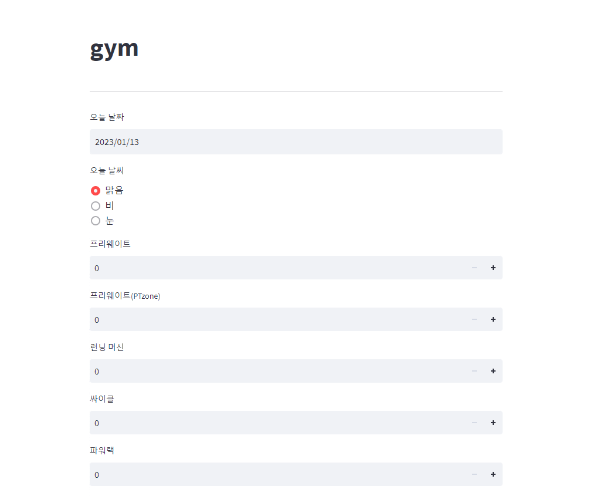
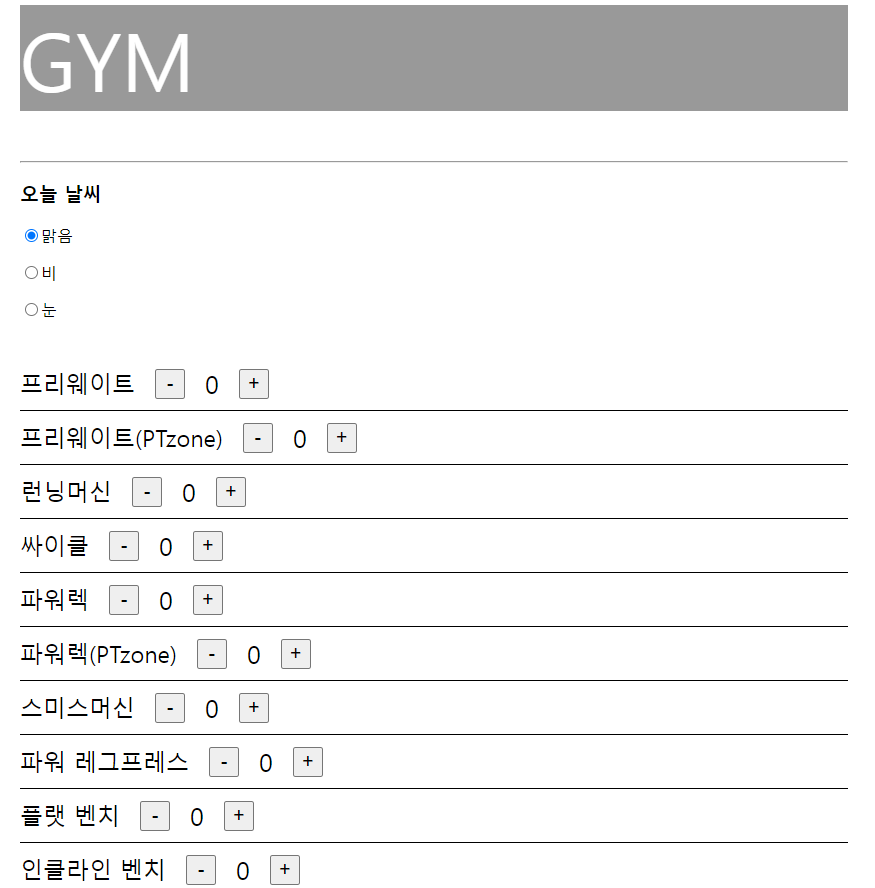

# Project_GYM

- 목적 : 헬스장 기구별 운동 사용인원 수집

- 데이터 수집 기간 : 2022.08.17 ~ 2022.10.28 중 평일, 48일

- [분석 파일](https://github.com/mintaewon/project_gym/tree/main/analysis)

- [분석 결과](https://docs.google.com/presentation/d/1T2ac3dJJWaO8pacicgMlyHf-mTADRTVmwVfx-WT7M78/edit){target="_blank"}

----

## 데이터 수집용 웹

### DEMO

[Code 위치](https://github.com/mintaewon/project_gym/tree/main/local-demo)

~~Web Page : <a href="http://35.230.34.77:8501" target="_blank">***Click URL***</a>~~ (아래쪽 웹 페이지로 교체)

Front : streamlit

Back : FastAPI

DB : MySQL (GCP Cloud SQL)

-----

### 개선 웹

[Code 위치](https://github.com/mintaewon/project_gym/tree/main/page)

Web Page : <a href="http://35.230.34.77:8000" target="_blank">***Click URL***</a>

Front : HTML, CSS, JavaScript

Back : FastAPI

DB : MySQL (내부 DB 구축)

